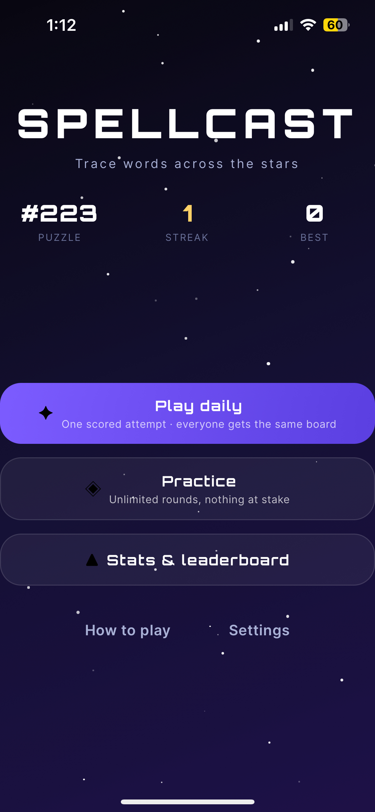
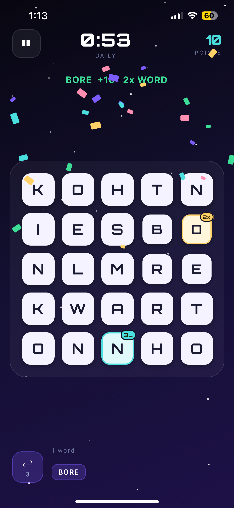
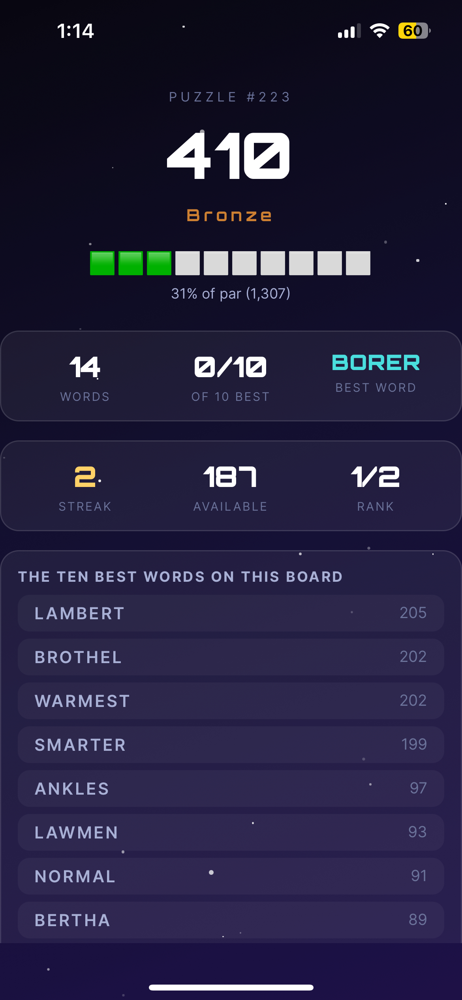

# SpellCast

**Trace words across the stars.** A daily word game for iOS and Android. One
board a day, sixty seconds, and everyone in the world gets the same letters.

Expo SDK 54 · React Native 0.81 · New Architecture · runs in Expo Go

|                                                   |                                                   |                                                      |
| ------------------------------------------------- | ------------------------------------------------- | ---------------------------------------------------- |
|  |  |  |
| The daily puzzle                                  | Sixty seconds                                     | What you missed                                      |

## Play

```bash
npm install
npm start        # scan the QR code with Expo Go
```

## What's in it

|                  |                                                                          |
| ---------------- | ------------------------------------------------------------------------ |
| **Daily puzzle** | One scored attempt per day. Same board for everyone, worldwide.          |
| **Streaks**      | Miss a day and it resets. Come back and it's waiting.                    |
| **Practice**     | Unlimited rounds, plus every past puzzle, replayable forever.            |
| **Bonus tiles**  | A gold tile doubles the word, a cyan tile triples a letter.              |
| **Combos**       | Words in quick succession build a multiplier up to 2.5×.                 |
| **Par**          | Scored against the ten best words on the board, not an arbitrary target. |
| **Stats**        | History, best word, average against par, medal bands.                    |
| **Sharing**      | A Wordle-style result you can post without spoiling the board.           |
| **Leaderboard**  | Local by default. Add two keys for a global daily board.                 |

## Slow mode

A second game on the same board: **pass and play, 2–6 players, five rounds
each**, with bots filling any empty seat. Modelled on Discord SpellCast, and
scored nothing like the daily mode.

| | Daily | Slow |
|---|---|---|
| Shape | one player, 60 seconds | 2–6 players, 5 turns each |
| What scores | word length dominates | letter values dominate |
| Long words | ×3 and +100 at seven letters | flat +10 at six |
| Letter values | 1 / 2 / 5 / 8 / 10 | 1 to 8, Scrabble-ish |
| Bonus tiles | fixed for the round | re-dealt every turn |
| The board | fixed for the round | used letters are replaced |
| Economy | none | gems buy abilities |

Letters carry the value here — Q and Z are worth 8, J and X 7, A/E/I/O just 1 —
so a short expensive word can beat a long cheap one. Each tile prints its own
value in the corner, so that is something you can read off the board rather than
having to remember. Double-letter, triple-letter and
2× word tiles move after every turn, and the letters a word consumed are
replaced, so no two players ever face the same board.

Gems sit on tiles; cover one with your word and you collect it, up to ten. They
buy **shuffle** (1), **swap a letter** (3) and **a hint** (4) — and every gem
you are still holding when the game ends is worth a point, so hoarding is a real
strategy. Turn off the clock, or leave it on and each turn lasts 30 seconds with
one gem buying fifteen more.

Bots are honest: they see exactly what you see — the solver over the live board —
and then deliberately play worse. Difficulty is a *band* of the ranked word list
rather than noise on the best word, so Easy reliably plays a mediocre word
instead of occasionally stumbling onto the best one. A bot's turn is played out
tile by tile rather than applied, because a bot that silently changed the score
would be indistinguishable from a bug.

The whole thing is a pure state machine in `src/game/slow/` — every action is
state in, state out — so a hundred complete games are played through in the test
suite on every run, checking that gems never exceed the cap, turns always
advance by exactly one, no word is ever played twice, and the board always still
has words in it.

## How it works

### Boards are verified, not hoped for

Most word games shuffle letters and hope. This one **solves** every board before
you ever see it.

A candidate board is generated from a seed, then searched depth-first from all
25 cells across a trie of the entire dictionary, following the same adjacency
rules the swipe engine uses — so the board can never be credited with a word
your finger physically can't trace. The result is scored on word count, long
words, vowel balance and letter repeats. If it doesn't clear the bar, the
generator tries again, keeping the best of up to twelve attempts.

Words are planted along **snaking paths** through the board rather than straight
lines, because a snake is what the swipe engine can actually follow.

**95% of boards clear the quality bar outright.** In a 200-board test the worst
board still contained 102 findable words. The bar itself is set from measured
percentiles, not guesses — the numbers are in the comment above it in
[`src/game/quality.js`](src/game/quality.js).

Solving a board costs about 1.6 ms.

### Every board is a pure function of its date

The daily seed is the UTC date, run through FNV-1a into a mulberry32 generator.
Nothing is stored, nothing is downloaded, and every puzzle ever published stays
playable forever — the practice archive simply regenerates them.

UTC rather than local time, because a leaderboard row labelled `2026-08-11` has
to mean the same board in Auckland and Los Angeles. That's also why puzzles are
**numbered** rather than dated: "#223" means the same thing everywhere.

### Two dictionaries, deliberately

| Tier              | Size          | Used for                                           |
| ----------------- | ------------- | -------------------------------------------------- |
| **ENABLE1**       | 105,185 words | Deciding whether what you traced is a real word    |
| **Common subset** | 20,838 words  | Par, board quality, seed words, the results screen |

So a real word is never rejected, and the game never congratulates you for
missing one nobody has heard of. Both live in a single trie whose terminals are
marked with their tier — one structure, one lookup.

### Par is the top ten words

Not the total of every word on the board. That averages ~3,100, which makes a
genuinely good minute read as "22% of par" and feels like failure. The ten best
average ~1,500 with a tight spread, so 40% is a strong round and the percentage
means the same thing from one day to the next.

The results screen leads with **"you found 6 of the 10 best words"** and then
shows you the ones you missed — which is the part that makes you want to play
again.

## Project layout

```
src/game/         board generation, solver, scoring, the daily calendar, swipe
                  rules. Imports nothing from React or react-native, which is
                  what lets the whole game engine be tested under plain node.
src/game/slow/    slow mode: its own scoring, its own board, and the turn-based
                  state machine — pure reducers, state in and state out.
src/storage/      settings, profile, daily records, streaks, the slow-mode roster
src/leaderboard/  one contract, two implementations
src/screens/      menu · daily · practice · game · results · stats · settings · help
                  slow setup · slow game · slow results
src/components/   board, tiles, swipe trail, buttons, sheets, confetti
src/theme/        colours, type, responsive board geometry
tools/            regenerate the dictionary and the audio, check imports
tests/            one suite per module
```

## Scripts

```bash
npm start                  # Expo dev server
npm test                   # 327 checks, 11 suites, no framework, no dev deps
npm run check              # verifies every local import resolves
npm run sim:slow           # play a whole slow-mode game out in the terminal
npm run build:dictionary   # re-download and rebuild both word tiers
npm run build:audio        # re-synthesise every sound from scratch
```

`npm test` covers RNG determinism, solver correctness, same-seed-same-board,
a 200-board quality sweep, UTC date boundaries and leap years, every streak
transition including a device clock moving backwards, storage migrations, and a
full round played end to end. Slow mode adds a hundred complete games played
turn by turn, asserting that gems never pass the cap, that a turn always
advances by exactly one, that no word is played twice, and that the board is
never left without a word on it.

`npm run sim:slow` prints a full game — every turn, every shuffle, every score,
and the final table. It drives the engine in the same order the screen does,
which is how a bot-shuffles-then-plays-a-stale-path soft-lock got caught before
it ever reached a phone.

## Sound

Every sound is **generated from scratch** by
[`tools/generate_audio.js`](tools/generate_audio.js) — a dependency-free
synthesiser that writes 14 PCM WAV files: a seamless 38-second ambient loop,
six rising select blips, and effects for words, combos, the final countdown and
game over. No samples, no licences, about 1.8 MB.

The loop is eight bars — Am F C G Dm Am F E — and **ends on the dominant**, so
the point where it restarts is a perfect cadence resolving into the Am it opens
on: the most settled moment in the piece rather than the most jarring. Every bar
has its own arpeggio rhythm and the shimmer runs on a three-bar cycle, so
nothing lines up to imply a shorter loop. Notes that run past the end wrap round
and add into the beginning, which is what makes the seam inaudible — measured,
the jump across the loop point is smaller than the largest ordinary
sample-to-sample step inside the file.

To use your own instead, drop a file with the same name into `assets/audio/`.
Nothing in the app cares how it was made.

## Optional: a global leaderboard

The game is finished without this. With no keys configured everything works and
the leaderboard screen shows your own history.

<details>
<summary><b>Setting up Supabase (free, ~5 minutes)</b></summary>

1. Create a project at <https://database.new>
2. **Authentication → Sign In / Providers → enable Anonymous sign-ins.**
   It's off by default, and every submit fails silently without it.
3. Run this in the SQL editor:

```sql
create table public.scores (
  id                uuid primary key default gen_random_uuid(),
  player_id         uuid not null default auth.uid(),
  date              date not null,
  puzzle            int  not null,
  generator_version text not null,
  score             int  not null check (score >= 0 and score <= 100000),
  word_count        int  not null default 0,
  best_word         text,
  best_word_score   int  default 0,
  par_percent       int  default 0,
  display_name      text,
  created_at        timestamptz not null default now(),
  unique (player_id, date, generator_version)
);

alter table public.scores enable row level security;

create policy "scores are public"
  on public.scores for select using (true);

create policy "insert own score"
  on public.scores for insert to authenticated
  with check (auth.uid() = player_id);

create policy "update own score"
  on public.scores for update to authenticated
  using (auth.uid() = player_id) with check (auth.uid() = player_id);

create index scores_daily_idx on public.scores (date, generator_version, score desc);
```

4. `cp .env.example .env`, paste in the project URL and anon key, then restart
   Metro with `npx expo start --clear` — `EXPO_PUBLIC_*` values are inlined at
   build time.

Local storage stays the base layer regardless: submissions are written locally
first and queued for retry if the network is gone, so history and stats work
whether the backend exists, is unreachable, or was never configured.

Scores are submitted by the client, so this is a _friendly_ leaderboard rather
than a cheat-proof one, and the app says so. Making it authoritative would mean
re-running the solver in an Edge Function against the seeded board — possible
precisely because `src/game/` is free of React, but a project of its own.

</details>

## ⚠️ Changing board generation

Bump `GENERATOR_VERSION` in [`src/config.js`](src/config.js) if you touch the
dictionary, the letter bag, the quality function, the seed-word count, or even
the **order** of `rng()` calls.

All of it feeds the seed. Change one and every board for every date changes —
past puzzles included — which invalidates stored par values and silently makes
old scores incomparable. The version is baked into the seed string, stored on
every saved result, and filtered on by every leaderboard query, so bumping it
keeps history honest instead of corrupting it.

## Credits

- **[ENABLE1](https://github.com/dolph/dictionary)** — the word list, released to
  the public domain by Alan Beale
- **[Orbitron](https://fonts.google.com/specimen/Orbitron)** and
  **[Inter](https://fonts.google.com/specimen/Inter)** — SIL Open Font License
- Sound and music: original, synthesised at build time

Licensed 0BSD.
