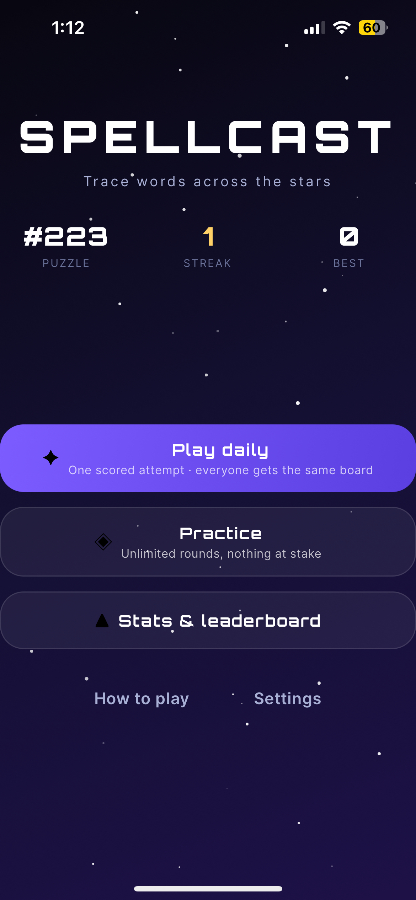
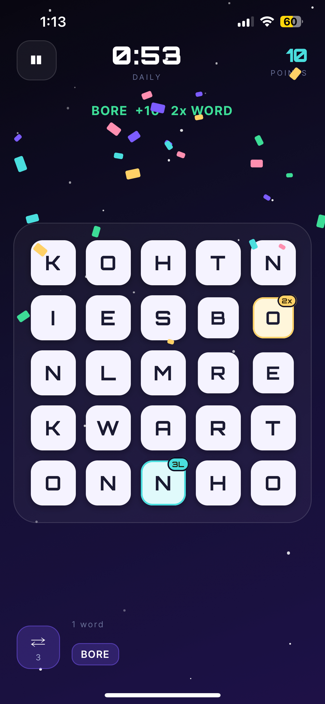
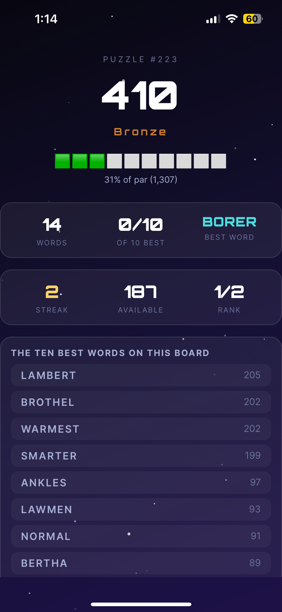

# Spacewrite

**Trace words across the stars.** A daily word game for iOS and Android. One
board a day, sixty seconds, and everyone in the world gets the same letters.

Expo SDK 54 · React Native 0.81 · New Architecture · runs in Expo Go

|                                                   |                                                   |                                                      |
| ------------------------------------------------- | ------------------------------------------------- | ---------------------------------------------------- |
|  |  |  |
| The daily puzzle                                  | Sixty seconds                                     | What you missed                                      |

## Play

```bash
npm install
npm start        # scan the QR code with Expo Go
```

## What's in it

|                  |                                                                          |
| ---------------- | ------------------------------------------------------------------------ |
| **Daily puzzle** | One scored attempt per day. Same board for everyone, worldwide.          |
| **Streaks**      | Miss a day and it resets. Come back and it's waiting.                    |
| **Practice**     | Unlimited rounds, plus every past puzzle, replayable forever.            |
| **Bonus tiles**  | A gold tile doubles the word, a cyan tile triples a letter.              |
| **Combos**       | Words in quick succession build a multiplier up to 2.5×.                 |
| **Par**          | Scored against the ten best words on the board, not an arbitrary target. |
| **Stats**        | History, best word, average against par, medal bands.                    |
| **Stardust**     | Earned every round, spent on backgrounds, soundtracks and costumes.      |
| **Sharing**      | A Wordle-style result you can post without spoiling the board.           |
| **Leaderboard**  | Local by default. Add two keys for a global daily board.                 |

## Slow mode

Called **Offline mode** in the app (and **Play online** when it is across
devices); the code and this document still say "slow", which is what it was
built as.

A second game on the same board: **pass and play, 2–6 players, five rounds
each**, with bots filling any empty seat. Modelled on Discord SpellCast, and
scored nothing like the daily mode.

| | Daily | Slow |
|---|---|---|
| Shape | one player, 60 seconds | 2–6 players, 5 turns each |
| What scores | word length dominates | letter values dominate |
| Long words | ×3 and +100 at seven letters | flat +10 at six |
| Letter values | 1 / 2 / 5 / 8 / 10 | 1 to 8, Scrabble-ish |
| Bonus tiles | fixed for the round | re-dealt every turn |
| The board | fixed for the round | used letters are replaced |
| Economy | none | gems buy abilities |

Letters carry the value here — Q and Z are worth 8, J and X 7, A/E/I/O just 1 —
so a short expensive word can beat a long cheap one. Each tile prints its own
value in the corner, so that is something you can read off the board rather than
having to remember. Double-letter, triple-letter and
2× word tiles move after every turn, and the letters a word consumed are
replaced, so no two players ever face the same board.

Everyone starts with **three gems**, as Discord's SpellCast did before it was
shut down in late 2025. More sit on
tiles; cover one with your word and you collect it, up to ten. They buy
**shuffle** (1), **swap a letter** (3) and **a hint** (4) — and every gem you
are still holding when the game ends is worth a point, so hoarding is a real
strategy. Turn off the clock, or leave it on and each turn lasts 30 seconds,
with one gem **resetting the clock** to a full turn (twice a turn at most). A
reset rather than a fixed top-up, so it is worth most when it is needed most.

Bots are honest: they see exactly what you see — the solver over the live board —
and then deliberately play worse. Difficulty is a *band* of the ranked word list
rather than noise on the best word, so Easy reliably plays a mediocre word
instead of occasionally stumbling onto the best one. A bot's turn is played out
tile by tile rather than applied, because a bot that silently changed the score
would be indistinguishable from a bug.

The whole thing is a pure state machine in `src/game/slow/` — every action is
state in, state out — so a hundred complete games are played through in the test
suite on every run, checking that gems never exceed the cap, turns always
advance by exactly one, no word is ever played twice, and the board always still
has words in it.

## How it works

### Boards are verified, not hoped for

Most word games shuffle letters and hope. This one **solves** every board before
you ever see it.

A candidate board is generated from a seed, then searched depth-first from all
25 cells across a trie of the entire dictionary, following the same adjacency
rules the swipe engine uses — so the board can never be credited with a word
your finger physically can't trace. The result is scored on word count, long
words, vowel balance and letter repeats. If it doesn't clear the bar, the
generator tries again, keeping the best of up to twelve attempts.

Words are planted along **snaking paths** through the board rather than straight
lines, because a snake is what the swipe engine can actually follow.

**95% of boards clear the quality bar outright.** In a 200-board test the worst
board still contained 102 findable words. The bar itself is set from measured
percentiles, not guesses — the numbers are in the comment above it in
[`src/game/quality.js`](src/game/quality.js).

Solving a board costs about 1.6 ms.

### Every board is a pure function of its date

The daily seed is the UTC date, run through FNV-1a into a mulberry32 generator.
Nothing is stored, nothing is downloaded, and every puzzle ever published stays
playable forever — the practice archive simply regenerates them.

UTC rather than local time, because a leaderboard row labelled `2026-08-11` has
to mean the same board in Auckland and Los Angeles. That's also why puzzles are
**numbered** rather than dated: "#223" means the same thing everywhere.

### Two dictionaries, deliberately

| Tier              | Size          | Used for                                           |
| ----------------- | ------------- | -------------------------------------------------- |
| **ENABLE1**       | 105,185 words | Deciding whether what you traced is a real word    |
| **Common subset** | 20,838 words  | Par, board quality, seed words, the results screen |

So a real word is never rejected, and the game never congratulates you for
missing one nobody has heard of. Both live in a single trie whose terminals are
marked with their tier — one structure, one lookup.

### Par is the top ten words

Not the total of every word on the board. That averages ~3,100, which makes a
genuinely good minute read as "22% of par" and feels like failure. The ten best
average ~1,500 with a tight spread, so 40% is a strong round and the percentage
means the same thing from one day to the next.

The results screen leads with **"you found 6 of the 10 best words"** and then
shows you the ones you missed — which is the part that makes you want to play
again.

### Stardust is earned, and it is not a theme system

A round pays **1 ✦ per 50 points**, plus 25 for finishing the daily, 10–60 for
the medal, and 30–350 the day a streak reaches 3, 7, 14 or 30. A typical silver
daily is 57 ✦. Practice pays a reduced rate and stops at 40 ✦ a day; slow mode
pays a flat 20, plus 20 for winning, capped at 80. Both caps exist because
practice is unlimited — without them the daily would stop mattering. Online
games pay by placing and have their own cap. The first background is affordable
on day three.

The first pass at these rates was miserly — 22 ✦ a day against the same catalog,
so fourteen weeks to own everything and a week before you could afford anything
at all. Nothing caught it, because every individual number looked sensible on
its own. `tests/economy.test.js` now models actual players, and makes two
promises since the premium suits arrived, because one number could no longer
hold both. The everyday shop (5,110 ✦: backgrounds, soundtracks and the
ordinary costumes) must clear in 14–90 days of dailies alone; and the whole
shop, suits included (7,460 ✦), in 21–60 days for someone who also plays a
practice session and an offline game each day. A premium suit must cost at
least two weeks of dailies, or it is not a goal.

The rules live in [`src/game/economy.js`](src/game/economy.js), which imports
nothing, so the rates are tested under plain node. Caps are passed **in** as a
`remaining` number rather than read from state, which keeps every function a
pure sum. The payout rides the **same `saveProfile` write** as the round's
statistics, so a round can never bank the score and lose the stardust; and the
calculation sits in its own `try`, so a bug in new economy code cannot cost
somebody their streak or their leaderboard row.

**Trying the shop without grinding.** Set `EXPO_PUBLIC_DEV_STARDUST=100000` in
your own `.env` and your profile is topped up to that amount, once. It takes two
locks, and needs both: `.env` is gitignored, so the number exists on one
machine; and it is only read when `__DEV__` is true, so a release build compiles
it to zero — even one built on that machine — and no player can receive it.

Backgrounds are deliberately **not** a theme system. Roughly twenty-one
components call `StyleSheet.create` at module scope with `colors.*` baked in, so
they cannot react to a runtime swap at all. Only the four things that actually
draw the backdrop are themed — the gradient, an alpha overlay, an SVG scenery
band and the particle field — and all four live in
[`Screen.js`](src/components/Screen.js). Everything else keeps assuming a dark
backdrop, which is why every catalog entry is required to stay below a relative
luminance of 0.18, and why `tests/economy.test.js` asserts that rather than
trusting it. The same test checks every SVG path for truncation: a malformed
`d` draws nothing and reports nothing.

`Screen` takes a `backgroundKey` prop that overrides the equipped choice without
persisting it. That one line is the whole of the shop's preview — and why
backing out of the shop reverts for free.

## Project layout

```
src/game/         board generation, solver, scoring, the daily calendar, swipe
                  rules. Imports nothing from React or react-native, which is
                  what lets the whole game engine be tested under plain node.
src/game/slow/    slow mode: its own scoring, its own board, and the turn-based
                  state machine — pure reducers, state in and state out.
src/storage/      settings, profile, wallet, daily records, streaks, slow roster
src/leaderboard/  one contract, two implementations
src/screens/      menu · daily · practice · game · results · stats · settings · shop
                  help · slow setup · slow game · slow results
src/components/   board, tiles, swipe trail, buttons, sheets, confetti, the
                  particle field and the SVG scenery behind every screen
src/theme/        colours, type, responsive board geometry, the background catalog
tools/            regenerate the dictionary and the audio, check imports
tests/            one suite per module
```

## Scripts

```bash
npm start                  # Expo dev server
npm test                   # 582 checks, 15 suites, no framework, no dev deps
npm run check              # verifies every local import resolves
npm run sim:slow           # play a whole slow-mode game out in the terminal
npm run build:dictionary   # re-download and rebuild both word tiers
npm run build:audio        # re-synthesise the sound effects from scratch
```

`npm test` covers RNG determinism, solver correctness, same-seed-same-board,
a 200-board quality sweep, UTC date boundaries and leap years, every streak
transition including a device clock moving backwards, storage migrations, and a
full round played end to end. Slow mode adds a hundred complete games played
turn by turn, asserting that gems never pass the cap, that a turn always
advances by exactly one, that no word is played twice, and that the board is
never left without a word on it.

`npm run sim:slow` prints a full game — every turn, every shuffle, every score,
and the final table. It drives the engine in the same order the screen does,
which is how a bot-shuffles-then-plays-a-stale-path soft-lock got caught before
it ever reached a phone.

## Sound

**Effects** are generated from scratch by
[`tools/generate_audio.js`](tools/generate_audio.js), a dependency-free
synthesiser: six rising select blips, and effects for words, combos, the final
countdown and game over. 13 small WAVs, about 0.2 MB. To use your own, drop a
file with the same name into `assets/audio/`.

**Music** is five CC0 tracks from [OpenGameArt](https://opengameart.org), in
`assets/audio/music/`. The first version of the game synthesised its music too,
but every track came out of the same synthesiser and they all sounded alike. The
replacements are deliberately different genres: ambient, synthwave, lofi hip
hop, pads and bells, and an aquatic theme. The last two are themed for the
Forest and Abyss backgrounds.

They're stored as **AAC in M4A** rather than MP3, about 10.5 MB in total. MP3
encoders pad the start and end of a file, which leaves a short gap every time a
track loops; M4A carries the metadata players use to skip that padding. Each
track was decoded and measured before it went in: two had silent tails (1.3 s
on Outer Space Loop and 8.5 s on Vintage Menu) that would have been a dropout at
every loop point, so those were trimmed. The keys in
[`tracks.js`](src/audio/tracks.js) are older than the music, so anything a
player had already bought or equipped carries over.

`tests/economy.test.js` checks that every track in the shop has a file, every
file exists, and every track credits its author and licence.

Settings has a **music volume** slider, separate from the effects. It is drawn
in [`Slider.js`](src/components/Slider.js) rather than installed, so there is
no extra native dependency; the music follows the thumb live and the value is
saved once, on release. The speaker button on the menu and in a game switches
the music only — effects have their own switch in Settings.

## Optional: a global leaderboard

The game is finished without this. With no keys configured everything works and
the leaderboard screen shows your own history.

The board is fetched as one request for the top hundred and shown twenty at a
time, with a small **More** button, so it never scrolls on forever and "More"
costs no further requests. If you placed below what is showing, your own row is
pinned under the list with its real rank.

<details>
<summary><b>Setting up Supabase (free, ~5 minutes)</b></summary>

1. Create a project at <https://database.new>
2. **Authentication → Sign In / Providers → enable Anonymous sign-ins.**
   It's off by default, and every submit fails silently without it.
3. Paste the whole of [`supabase/schema.sql`](supabase/schema.sql) into the SQL
   editor and run it. It creates the leaderboard table, the online slow-mode
   tables, their row-level security policies and the matchmaking functions, and
   it is written to be re-runnable.

4. `cp .env.example .env`, paste in the project URL and anon key, then restart
   Metro with `npx expo start --clear` — `EXPO_PUBLIC_*` values are inlined at
   build time.

Local storage stays the base layer regardless: submissions are written locally
first and queued for retry if the network is gone, so history and stats work
whether the backend exists, is unreachable, or was never configured.

Scores are submitted by the client, so this is a _friendly_ leaderboard rather
than a cheat-proof one, and the app says so. Making it authoritative would mean
re-running the solver in an Edge Function against the seeded board — possible
precisely because `src/game/` is free of React, but a project of its own.

</details>

## ⚠️ Changing board generation

Bump `GENERATOR_VERSION` in [`src/config.js`](src/config.js) if you touch the
dictionary, the letter bag, the quality function, the seed-word count, or even
the **order** of `rng()` calls.

All of it feeds the seed. Change one and every board for every date changes —
past puzzles included — which invalidates stored par values and silently makes
old scores incomparable. The version is baked into the seed string, stored on
every saved result, and filtered on by every leaderboard query, so bumping it
keeps history honest instead of corrupting it.

## The mascot

An astronaut, rigged: the helmet, visor, antenna, arms, legs, torso, backpack
and jetpack flame are separate parts, each with its own pivot, so it can wave,
facepalm, backflip and fire its jetpack while it floats. It reacts to play (a
fist pump for a word, a backflip for a long one, a facepalm for a miss, a dizzy
spin when you shuffle, panic in the last ten seconds), its eyes follow your
finger across the board, it watches a bot trace its word, and its visor reflects
whichever background you have equipped. On the menu it drifts, looks around
and fidgets unprompted; tap it for a trick.

Everything about it is data, in three layers:

- [`src/theme/astronaut.js`](src/theme/astronaut.js) is the rig and the art:
  every part's box, pivot and shapes.
- [`src/theme/astronautMoves.js`](src/theme/astronautMoves.js) is the
  choreography, as keyframes: looping idle tracks per resting mood, one-shot
  reactions, and fidgets.
- [`src/components/mascot/useRig.js`](src/components/mascot/useRig.js) turns
  keyframes into native-driven `Animated` motion. Each part keeps separate
  idle, action and gaze layers that are *added*, which is what lets it wave
  while drifting and watch your finger while breathing.

`tests/mascot.test.js` checks that every track names a real part, that idle
loops end where they start, and that every reaction lands back at rest (or an
arm would stay stuck in the air). It also does real forward kinematics: the
facepalm glove has to land on the visor, and the thinking glove on the chin.

One trap worth knowing: `Animated.loop` resets each timing by default, and
resetting snaps a value back to the number it was **created** with. For a rig
built on a rest pose, that jerked the astronaut upright at the top of every
loop. The idle loops run with `resetBeforeIteration: false`, which is safe
because the test above guarantees each one ends where it starts.

In the small hours, by the player's own clock, it sleeps on the menu. A tap
wakes it with a stretch and a yawn, and it stays up until it has been left
alone for 45 seconds.

### Costumes

Sold in the shop, and data like the rig they dress
([`src/theme/costumes.js`](src/theme/costumes.js)). A costume is extra shapes
keyed by rig part and drawn in that part's own coordinates, so each piece moves
with what it is attached to: a hat tilts when the head nods and goes round with
a backflip, and nothing in the animation has to know. Three things a costume
can do beyond that:

- **hold something.** A prop goes on an arm and ends with the glove drawn
  again on top, so the lasso, magnifying glass or cutlass runs *through* the
  fist rather than across the front of it.
- **cover something inside a part.** `over` pieces are drawn above a part's
  children — the pirate's eyepatch has to sit over an eye that lives inside
  the visor, and is clipped by the visor's window like a sticker.
- **recolour the suit.** The two premium suits carry a `palette`, a
  role-for-role swap over the rig's own colours (gold; and the Mk II's graphite
  with cyan edges and a cyan thruster flame). The swap is by colour value, so
  every rig colour role needs its own hex — a test holds that — and a costume's
  own pieces are never swapped.

The same tests that check the rig check every costume shape, that every piece
is pinned to a real part, and that premium costs more than everything else.

**Replacing it with Rive or Lottie.** Screens only talk to the mascot through
`<Mascot size mood reaction lookAt restless roam onPress />`. `mood` maps onto
a Rive state, `reaction: { mood, key }` onto a trigger fired when `key`
changes, and `lookAt` onto two number inputs. A `RiveMascot` with that
signature is a one-import swap. Note that `rive-react-native` is a native
module that isn't in Expo Go, so it needs a development build.

## The bots are characters

Six bots, each with a face, a title, a line about them, and a taste that really
changes how they play: Nova plays short and fast, Orion hunts long words, Vega
grabs gems, Lyra collects rare letters, Atlas builds on bonus tiles, and Rigel
shuffles at the slightest excuse.

Taste only decides **which** word a bot picks from inside its difficulty band
([`bot.js`](src/game/slow/bot.js)), so difficulty is still the player's choice
and stays balanced. `tests/characters.test.js` measures each taste against a
plain bot on the same boards, so no profile can claim a behaviour the bot
doesn't have. It also checks that every character's Easy stays below every
character's Medium, and every Medium below every Hard.

Characters are resolved from the bot's **name** ([`characters.js`](src/game/slow/characters.js)),
because saved rosters, online rooms and the engine all already carry a name and
nothing else. Every existing game gets its characters with no migration.

## Online slow mode

Slow mode plays across devices as well as around one phone. A host creates a
room, shares a five-character code, and everyone plays one live session of five
rounds; at the end every device shows the same finishing order.

**It synchronises moves, not game state.** Every client starts from
`createSlowGame({ seed, players })` and replays the log through the same pure
reducers the local game uses, which works because of two properties the engine
already had:

- `src/game/slow/` contains no `Math.random()` and no `Date.now()`. Every random
  thing — the opening board, the refill, the bonus tiles, the gem respawn, a
  shuffle — is seeded from the game seed and the turn index.
- a board is `{ letters, modifiers, gems, version }`: plain arrays. The solver's
  output is memoised beside the board, never stored on it.

So the state is a pure function of `(config, moves)`. A word on the wire is its
cell indices and nothing else, reconnecting is just replaying from the start,
and two clients cannot drift. `tests/replay.test.js` plays a game live, replays
the log, and asserts the boards match letter for letter — including when the log
arrives backwards.

It also means the optimistic path is not a guess. When you play a word the local
`submitWord()` returns exactly the state every other device will derive from
that move, so the existing celebration stagecraft works unchanged and there is
nothing to reconcile.

**Concurrency** is one unique index. `slow_moves` has `unique (room_id, seq)`;
two clients racing for the same turn compute the same `seq`, exactly one insert
survives, and the loser re-reads. No locks, no leader election.

**What it does not do:** the RLS policy checks that you are seated in the room
and that the room is running, but *not* that it is your turn — Postgres cannot
work that out without replaying the JS engine. Turn order is enforced by the
clients. That is the same "friendly, not cheat-proof" line the daily leaderboard
already draws; what it does prevent is a stranger writing into your game.

Bots are played out by the host only. If every client ran them they would each
pick a different word before racing to write it, so the move that landed would
not be the one most people watched.

## ⚠️ Do not change the slug

`app.json`'s `slug` is **not** cosmetic. Expo Go scopes AsyncStorage into a
database named `RKStorage-scoped-experience-<scopeKey>`, and the scope key
contains the slug — so changing it silently points the app at a brand new,
empty database. Every player's streak, history, stats and stardust appear to
vanish. (`AsyncStorageExpoMigration.java` in `@react-native-async-storage`
documents exactly this: *"if a user publishes an app with Expo, then changes
the slug and publishes again, a new database will be created"*.)

Nothing is actually deleted — the old scoped database is still on the device —
but the only way back is to put the slug back exactly as it was.

The app was renamed to Spacewrite; **the slug stayed `SpellCast`**, and so did
two other strings, all for the same reason:

| String | Where | Why it is frozen |
| ------ | ----- | ---------------- |
| `SpellCast` | `app.json` `slug` | the AsyncStorage scope key |
| `spellcast/` | [`src/storage/keys.js`](src/storage/keys.js) | the prefix on every stored key |
| `spellcast:` | [`src/game/daily.js`](src/game/daily.js) | an input to the board seed |

Only `name` — the label under the icon — is safe to change.

## Credits

- **[ENABLE1](https://github.com/dolph/dictionary)** — the word list, released to
  the public domain by Alan Beale
- **[Orbitron](https://fonts.google.com/specimen/Orbitron)** and
  **[Inter](https://fonts.google.com/specimen/Inter)** — SIL Open Font License
- Sound effects: original, synthesised at build time
- Music, all [CC0](https://creativecommons.org/publicdomain/zero/1.0/) via
  OpenGameArt, credited though not required:
  [Outer Space Loop](https://opengameart.org/content/outer-space-loop) by wipics ·
  [Vintage Menu](https://opengameart.org/content/vintage-menu) by iamoneabe ·
  [Lofi Hip Hop Loop](https://opengameart.org/content/lofi-hip-hop-loop) by omfgdude ·
  [Cathedral in the forest](https://opengameart.org/content/cathedral-in-the-forest-ambient-loop) by congusbongus ·
  [Underwater Theme II](https://opengameart.org/content/underwater-theme-ii) by CleytonKauffman

Licensed 0BSD.
